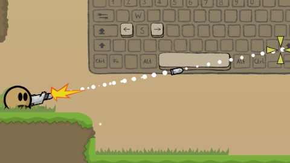

# 075_tw_dm1_join_chat_walk_disconnect

This pcap was generated on my local machine (linux debian 13)
using the official ddnet release for server and client.

- **client**: [official ddnet 19.4 release for linux](https://ddnet.org/downloads/DDNet-19.4-linux_x86_64.tar.xz)
- **server**: [official ddnet 19.4 release for linux](https://ddnet.org/downloads/DDNet-19.4-linux_x86_64.tar.xz)
- **map**: Tutorial crc=801ce63d sha256=796a3716fe64657bfb8bc6af5f9422b197278919a9d875e43b9bbbcb73262fc0
- **version**: 0.6.4 (ddnet 19.4)

The pcap captured the full cycle of a player joining, sending the chat message "hello"
walking right, falling, walking left, falling, walking right, shooting right and disconnecting.




## Setup

Download offical release for linux and make sure it uses local storage
to avoid user wide configs to interfere.

```
wget https://ddnet.org/downloads/DDNet-19.4-linux_x86_64.tar.xz
tar xvf DDNet-19.4-linux_x86_64.tar.xz
cd DDNet-19.4-linux_x86_64
printf '%s\n%s\n' 'add_path $CURRENTDIR' 'add_path $DATADIR' > storage.cfg
```

Start the server in one terminal tab.

```
./DDNet-Server > server_log.txt
```

Start the traffic capture in another one.

```
sudo tcpdump -i lo "port 8303" -w 064_ddnet_join_chat_walk_disconnect.pcap
```

Connect the client.

```
./DDNet "gfx_fullscreen 0;gfx_screen_width 1600;gfx_screen_height 900;cl_auto_demo_record 1;connect 127.0.0.1"
```

After the client disconnected stop the tcpdump and generate the tshark log.

```
tshark -r 064_ddnet_join_chat_walk_disconnect.pcap > tshark_libtw2.txt
```
