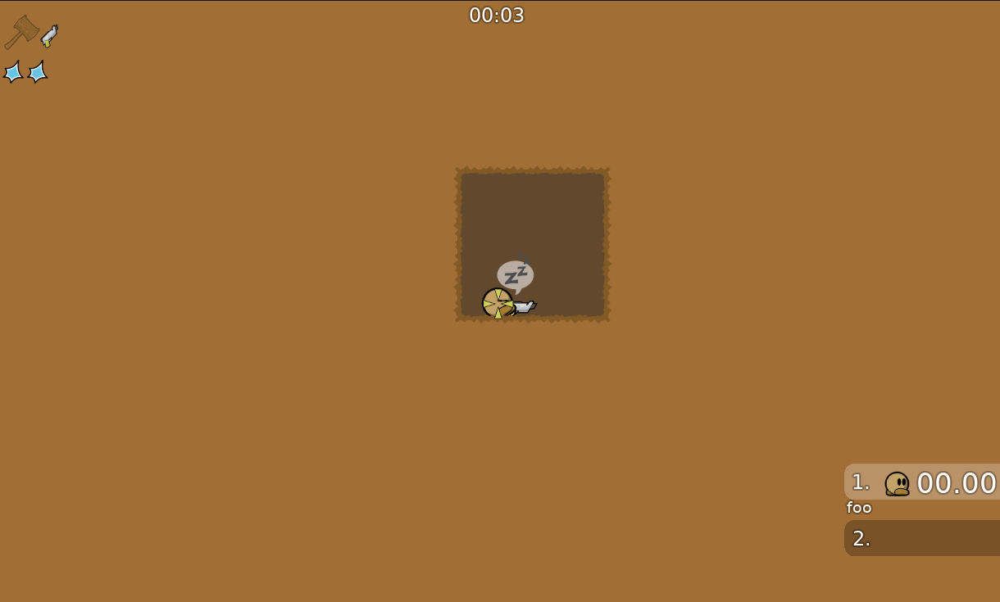
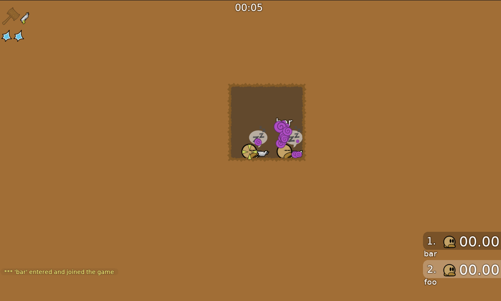
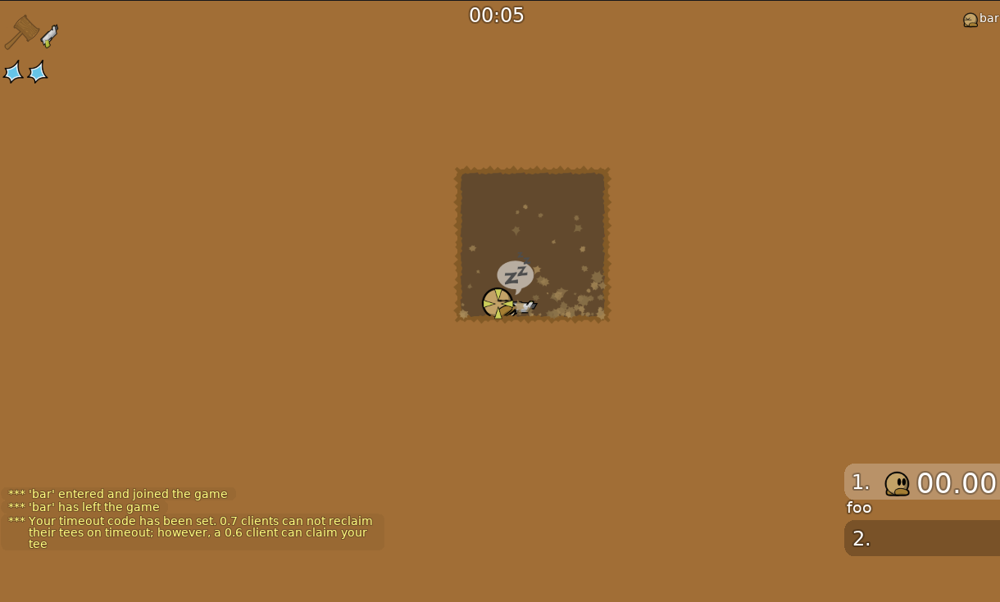

# 075_ddnet_tinycave_other_player_join

This pcap was generated on my local machine (linux debian 13)
using the official ddnet release for server and client.

- **client**: [official ddnet 19.6 release for linux](https://ddnet.org/downloads/DDNet-19.6-linux_x86_64.tar.xz)
- **server**: [official ddnet 19.6 release for linux](https://ddnet.org/downloads/DDNet-19.6-linux_x86_64.tar.xz)
- **map**: Tutorial crc=801ce63d sha256=796a3716fe64657bfb8bc6af5f9422b197278919a9d875e43b9bbbcb73262fc0
- **version**: 0.7.5 (ddnet 19.6)

The pcap is out of the perspective of a player called "foo" it captures its join.
Then another player called "bar" joins and leaves again and then "foo" leaves.





## Setup

Download offical release for linux and make sure it uses local storage
to avoid user wide configs to interfere.

```
wget https://ddnet.org/downloads/DDNet-19.6-linux_x86_64.tar.xz
tar xvf DDNet-19.6-linux_x86_64.tar.xz
cd DDNet-19.6-linux_x86_64

wget https://github.com/ChillerTW/GitMaps/raw/refs/heads/master/tinycave.map
# if the sha is wrong do a git clone and git checkout 29184b26b3caf391e3495366e6488dfc77e89de2
[[ "$(sha256sum tinycave.map)" = "b00a78c7d3922092537d165f9897bd40846a46934c209bf6748f718bf30b5fdd  tinycave.map" ]] || echo "Error: wrong map sha"
cp tinycave.map data/maps
mv tinycave.map data/maps7

printf '%s\n%s\n' 'add_path $CURRENTDIR' 'add_path $DATADIR' > storage.cfg
```

Start the server in one terminal tab.

```
./DDNet-Server "sv_map tinycave" > server_log.txt
```

Start the traffic capture in another one. Listening only on the port of the client "foo".

```
sudo tcpdump -i lo "port 11200" -w 075_ddnet_tinycave_other_player_join.pcap
```

Connect the client.

```
./DDNet "cl_port 11200;player_name foo;gfx_fullscreen 0;gfx_screen_width 1600;gfx_screen_height 900;cl_auto_demo_record 1;connect tw-0.7+udp://127.0.0.1"
```

Connect the second client and then close it again.

```
./DDNet "player_name bar;gfx_fullscreen 0;gfx_screen_width 1600;gfx_screen_height 900;cl_auto_demo_record 0;connect tw-0.7+udp://127.0.0.1"
```

After the first client disconnected stop the tcpdump and generate the tshark log.

```
tshark -r 075_ddnet_tinycave_other_player_join.pcap > tshark_libtw2.txt
```
