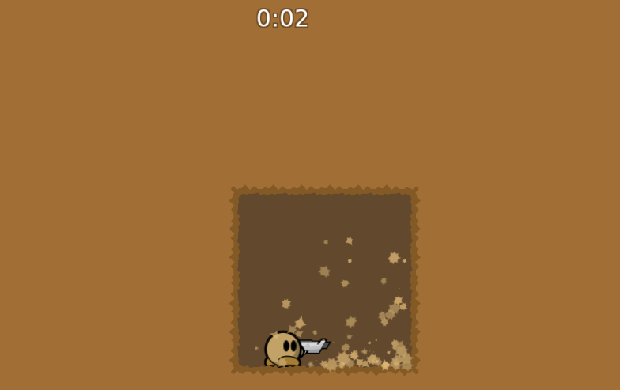

# 075_tw_tinycave_other_player_join_round_start

This pcap was generated on my local machine (linux 6.16.10-arch1-1)
using the official teeworlds release for server and client.

- **client**: [official teeworlds 0.7.5 release for linux](https://downloads.teeworlds.com/teeworlds-0.7.5-linux_x86_64.tar.gz)
- **server**: [official teeworlds 0.7.5 release for linux](https://downloads.teeworlds.com/teeworlds-0.7.5-linux_x86_64.tar.gz)
- **map**: tinycave crc=ff4d6acb sha256=b00a78c7d3922092537d165f9897bd40846a46934c209bf6748f718bf30b5fdd
- **version**: 0.7.5 (0.7 802f1be60a05665f)

The pcap captured the player called "foo" already being connected.
Not moving just standing still. The server was just launched.
Then player "bar" joins the game triggering a round start.
Both players are interpreted as ready and the server ends the warmup phase.
So the game timer will be reset and both tees respawn at the same time.
Then player "bar" disconnects. The traffic between client "bar" and the server
is filtered out. So this pcap is from the client side perspective of the player "foo".




## Setup

Download offical release for linux and make sure it uses local storage
to avoid user wide configs to interfere.

```
wget https://downloads.teeworlds.com/teeworlds-0.7.5-linux_x86_64.tar.gz
tar xvf teeworlds-0.7.5-linux_x86_64.tar.gz
cd teeworlds-0.7.5-linux_x86_64
wget https://github.com/ChillerTW/GitMaps/raw/refs/heads/master/tinycave.map
# if the sha is wrong do a git clone and git checkout 29184b26b3caf391e3495366e6488dfc77e89de2
[[ "$(sha256sum tinycave.map)" = "b00a78c7d3922092537d165f9897bd40846a46934c209bf6748f718bf30b5fdd  tinycave.map" ]] || echo "Error: wrong map sha"
mv tinycave.map data/maps
printf '%s\n%s\n' 'add_path $CURRENTDIR' 'add_path $DATADIR' > storage.cfg
```

Start the server in one terminal tab. And keep it running.

```
./teeworlds_srv "sv_map tinycave" > server_log.txt
```

Connect client to download the map once. And keep it running.

```
./teeworlds "gfx_fullscreen 0;gfx_screen_width 1600;gfx_screen_height 900;cl_auto_demo_record 1;player_name foo;connect 127.0.0.1"
```

Start the traffic capture in another terminal. Here we capture only the traffic
of the client port. This port gets randomly assigned so it is different each launch.
In this run it was 61660. This is to get a dump from the perspective of the first client
and it removes all traffic sent from or to the second client.

```
sudo tcpdump -i lo "port 61660" -w 075_tw_tinycave_other_player_join_round_start.pcap
```

Connect the second client.

```
./teeworlds "gfx_fullscreen 0;gfx_screen_width 1600;gfx_screen_height 900;cl_auto_demo_record 0;player_name bar;connect 127.0.0.1"
```

After the client disconnected stop the tcpdump and generate the tshark log.

```
tshark -r 075_tw_tinycave_other_player_join_round_start.pcap > tshark_libtw2.txt
```
